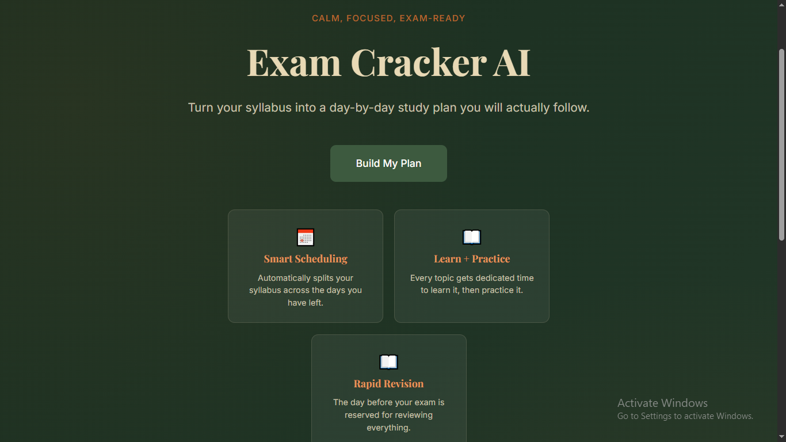
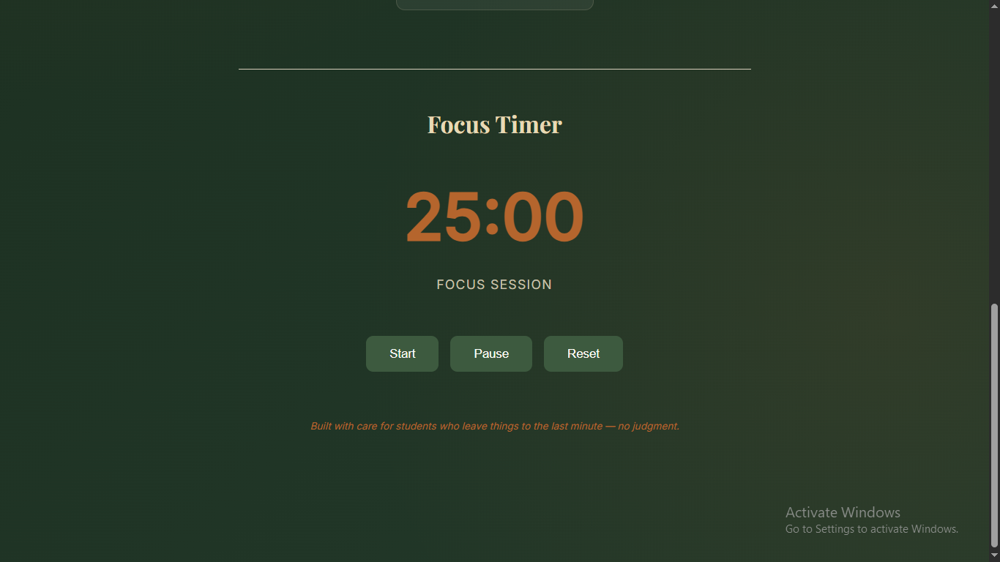
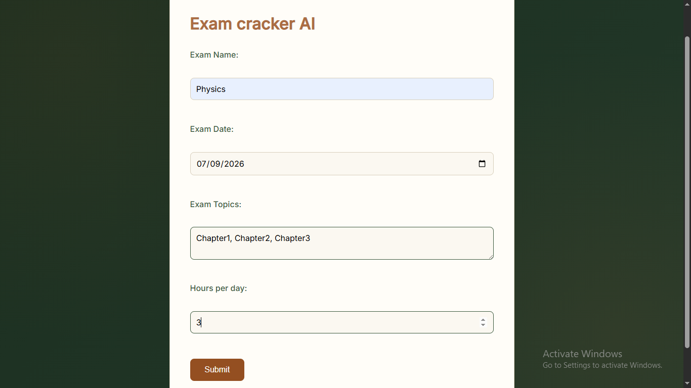
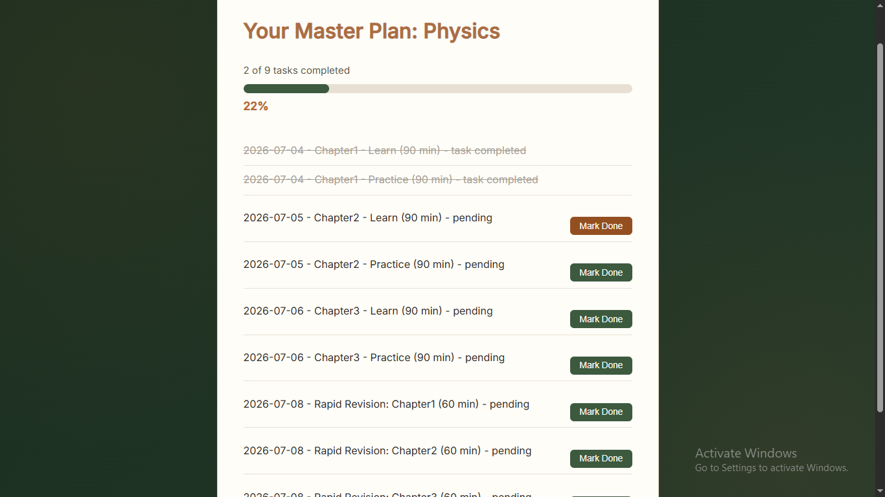
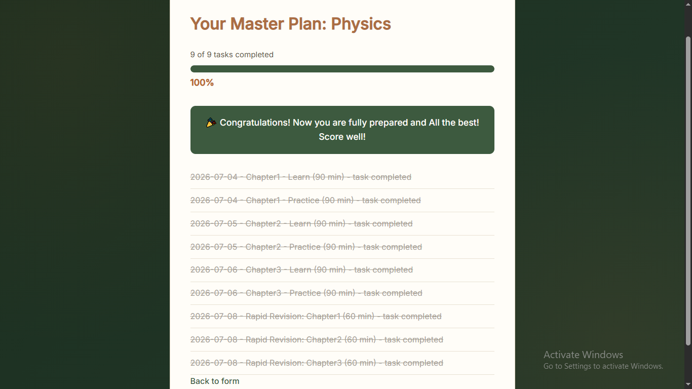
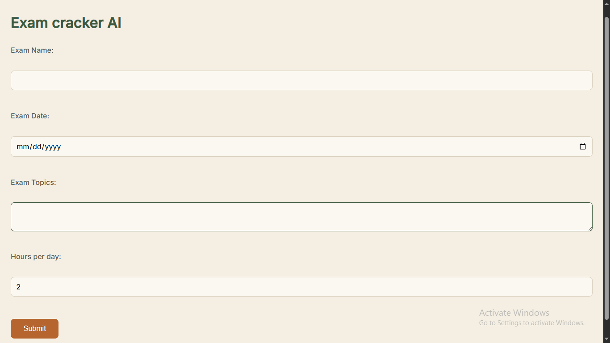
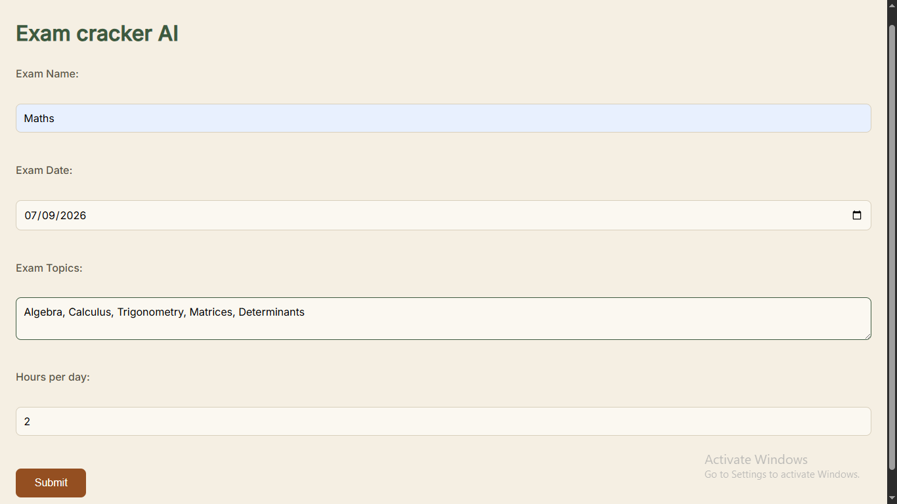
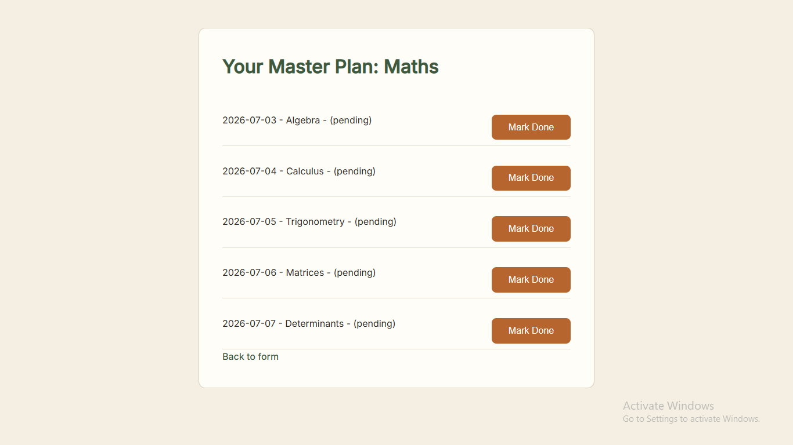
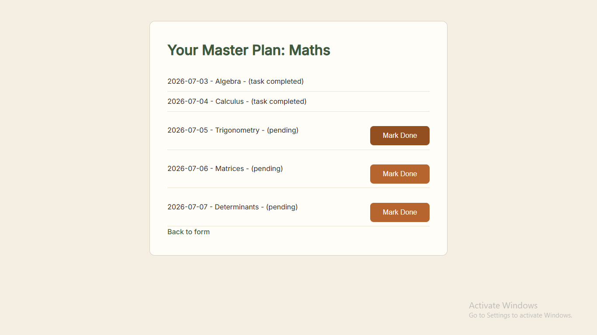

## Exam Cracker AI
 This Exam Cracker Ai helps student manage their schedule for exam and keep a track on it and mark the progress done. They are also provided with the pomodoro timer!!
## Why I built this
This is a project that is personally connected to me as i have face problem time managing during exams, and I don't want kids like me suffer like this.

## What it does
I asks for basic info like topics, the date of exam etc. and tells the schedule on basis of that. With easy and minimal user interface it is easy to use!
IT generates a day-by-day schedule, splits Learn and practice time for each topic, provides schedule for rapis revision day befor exam! lets you mark topics done, tracks progress with it's tracking system.
When all the tasks are completed you get a congratulations ! message.
For precission, timer is the best key to crack the exam.

## Tech stack
- Python
- Flask 
- HTML/CSS 
- Jinja2 templating
- JavaScript

## How it works
There is a landing page and it contains a form asking name of your exam, the date, the topics and the the no. of hours you can study ! and focous timer to increase the productivity ! they submit the info and are directed to the Master Plan page with their schedule, they also have the option to mark it done and keep a check on the progress provided by the app.
## Screenshots

## Live Demo
[Try it here](https://exam-cracker-ai.onrender.com)

## Running it locally
1. Clone this repo
2. Install Flask: `pip install flask`
3. Run: `python app.py`
4. Visit `http://127.0.0.1:5050`

## AI use
I used Claude (AI assistant) for helping me debug errors, and explain conceps i did not understand (flask). I typed and wrote all the code myself, and I promise that !

## Built for
Hack Club Horizons Europa
